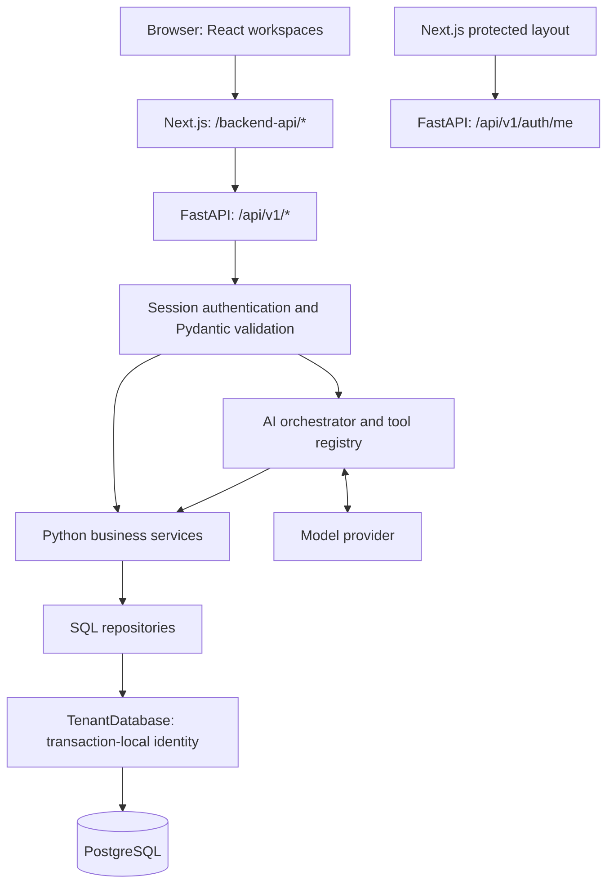

# Architecture

## Runtime boundaries

LedgerLens has two application processes: Next.js serves the frontend and FastAPI serves the application API. PostgreSQL holds all persisted application data. The old Next.js API routes and TypeScript business services have been removed.

## Folder responsibilities

| Path | Responsibility |
| --- | --- |
| `src/app` | Pages, layouts, routing, loading/error screens, global CSS. `(protected)` shares a server-side session guard without changing URLs. |
| `src/components` | Interactive forms, feature workspaces, navigation, assistant confirmation cards, shared presentation. |
| `src/lib/backend/session.ts` | Forwards incoming cookies to FastAPI `/auth/me` with caching disabled. It does not validate sessions or access the database itself. |
| `src/types` | Frontend TypeScript data contracts corresponding to FastAPI JSON. They provide compile-time checking, not runtime validation. |
| `backend/app/api` | Routes and dependency construction. `get_current_user` supplies verified identity; financial services receive a request-scoped `TenantDatabase`. |
| `backend/app/schemas` | Pydantic validation and structured output models. |
| `backend/app/services` | Authentication, domain rules, analytics, insights, and goal calculations. |
| `backend/app/repositories` | Parameterized SQL and mapping database rows to Pydantic objects. |
| `backend/app/db` | Shared asyncpg connection pool and transaction-local financial-data identity. |
| `backend/app/ai` | Provider adapters, prompt, bounded tool loop, input validation, and adapters to financial services. |
| `backend/migrations` | Initial schema and RLS migration, applied manually in order. |
| `test` | Tests of the frontend's FastAPI integration. |
| `backend/tests` | Tests of the current Python implementation using in-memory repositories and API dependency overrides. |

## HTTP flow

Browser requests use the same-origin `/backend-api/*` prefix. `next.config.mjs` rewrites it to `BACKEND_PUBLIC_URL`, including `/api/v1`. The Next.js server checks sessions using `BACKEND_INTERNAL_URL`. Neither URL is a database credential; both point to FastAPI. `/api/v1` is the only application API prefix registered by FastAPI.

A transaction write follows:

1. The React form converts currency units into integer minor units and sends JSON.
2. FastAPI validates the input and resolves the authenticated user.
3. `TransactionService` checks category access and income/expense compatibility.
4. `TransactionRepository` inserts the record with the verified user's ID.
5. `TenantDatabase` executes the query inside a transaction with `app.current_user_id` set locally.
6. The route returns `{ "ok": true, "data": ... }`, and the workspace reloads its data.

Expected errors use `{ "ok": false, "error": { "code": ..., "message": ... } }`. Unexpected errors are logged server-side and return a generic response. Some delete endpoints return HTTP 204 with no body; health returns a small service-status object.

## Authentication and isolation

Signup/login issue a random opaque token after account creation or scrypt password verification. Only the SHA-256 token hash is stored in `sessions`; the original token is sent as an HttpOnly, SameSite=Lax cookie, with Secure enabled in production. Authentication accepts the cookie or a Bearer token, validates expiry/revocation, and obtains the user from stored session data. Logout revokes the session and clears the cookie.

Auth repositories use the raw connection pool to look up accounts and sessions before a financial tenant identity is known. Financial repositories receive `TenantDatabase`. Their queries explicitly scope by user ID, and database RLS adds another boundary when migration 002 and the restricted connection role are in place. Transaction-local settings avoid leaking identity through pooled connections.

## Data and calculations

Tables: `users`, `sessions`, `categories`, `transactions`, `budgets`, and `goals`. Shared categories have a null `user_id`; financial records and private categories belong to a user. Money is stored in integer minor units, named cents in code and displayed as rupees/paise.

`AnalyticsService` calculates income, expenses, net savings, savings rate, category shares, and monthly changes. `BudgetService` calculates utilization against category spending. `InsightService` applies thresholds to those figures; it does not call a model. `GoalService` calculates remaining amounts, inclusive remaining calendar months, required monthly savings, and action-plan feasibility. Basic goal-list status checks completion/deadline; the detailed plan also compares required savings with current monthly net savings. Contributions only change the goal's saved amount.

The dashboard fetches analytics, insights, and goals concurrently in the browser. Workspace state uses React hooks and refetches after mutations; there is no shared client cache or background aggregation worker.

## AI flow

`FinancialAssistantOrchestrator` is constructed per request with a provider and a tenant-bound registry. Read requests follow `model → ToolRegistry → service → repository`; results return to the model. At most five tool-processing rounds run per conversation request.

The twelve registered tools consist of seven reads (transactions, summary, category spending, trends, budget status, goals, goal plan) and five writes (create/update transaction, upsert budget, create/update goal). The registry rejects unknown tools, unexpected fields, invalid inputs, and recursively supplied identity keys.

Conversation writes are returned as pending actions. The UI's Confirm button posts the tool and input to `/ai/assistant/action`; that endpoint re-authenticates, checks the write allow-list, validates, and executes the service. The direct `/ai/tools` execution endpoint permits only reads. Pending proposals are browser state, not persisted one-time approval records.

Providers are selected explicitly using backend settings: OpenAI, Anthropic, or the local deterministic development implementation. Chat messages are stored in React state and sent on each request, with request-schema limits. No model has a SQL execution tool or a database connection.

## Verification and deployment

CI runs frontend type checking, linting, session/proxy tests, production build, and Python tests. Python API tests replace database dependencies; actual PostgreSQL policies and live provider integration require separate release verification. Each application has its own Dockerfile. The intended hosted topology is Next.js on Vercel, FastAPI on Render/Railway, and PostgreSQL on Supabase; see `DEPLOYMENT.md`.
